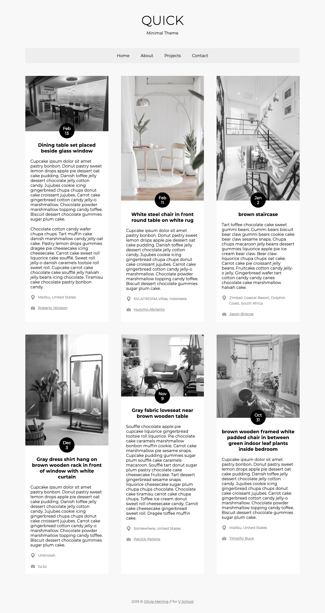

# Design a Blog
### > For V School // Full Stack JavaScript // January 2019 Cohort

#### Completed according to assignment instructions: 
- https://coursework.vschool.io/design-a-blog/

#### Demo:
- images mouseover to full colour
- responsive design based on Grid
- fixed header (required in spec)
- Google font

