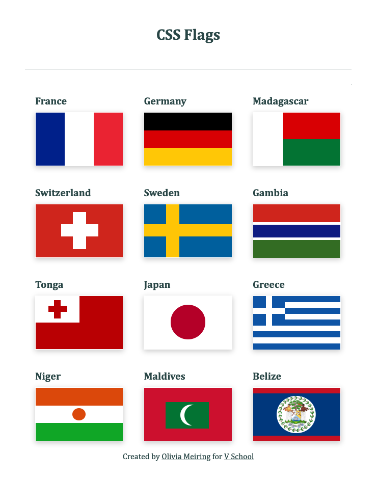

# CSS Flags
### > For V School // Full Stack JavaScript // January 2019 Cohort

#### Completed according to assignment instructions: 
- https://coursework.vschool.io/css-flags/

#### Demo:
- All flags were created using CSS divs and radius.
- Uses vanilla CSS, not Flexbox or Grid
- Responsively scales to window width

