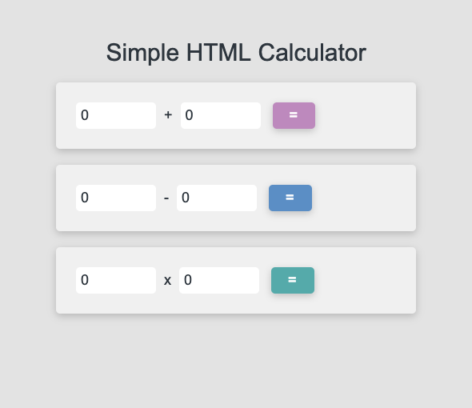

# Simple HTML Calculator
### > For V School // Full Stack JavaScript // January 2019 Cohort

#### Demo:

#### Completed according to assignment instructions: 
- https://coursework.vschool.io/simple-calculator/
<blockquote>You are going to create a simple calculator that can Add, Subtract, and Multiply.

*Requirements:*

- You will have one section (`
`) for each math operation (so 3 sections) total
- Each section has two inputs to take the first and second numbers
- Each section will have a button to perform the operation
- You will inject the result into the HTML (not an alert)
- Your website will have 3 colors
- Your website will have proper padding/spacing to lay things out nicely</blockquote>
