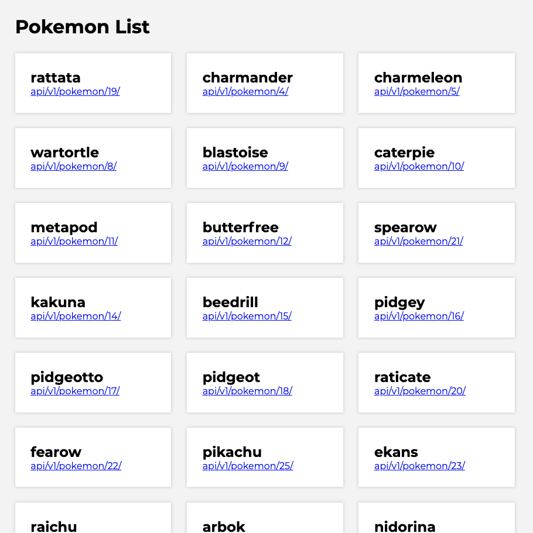

# Pokemon List
### > For V School // Full Stack JavaScript // January 2019 Cohort

#### Completed according to assignment instructions: 
- https://coursework.vschool.io/pokemon-list/

>The following exercise should be completed in vanilla JavaScript.
>
>Use https://api.vschool.io/pokemon as your url for your XHR request to get the big list of pokemon.
>
>It will be easiest to do this is steps:
>
>Step one - get the data
>Step two - display the data

#### DEMO: <a href="https://htmlpreview.github.io/?https://github.com/yummywakame/V-School-Assignments/blob/master/exercises/week-04/03-pokemon-list/index.html">Pokemon List</a>

