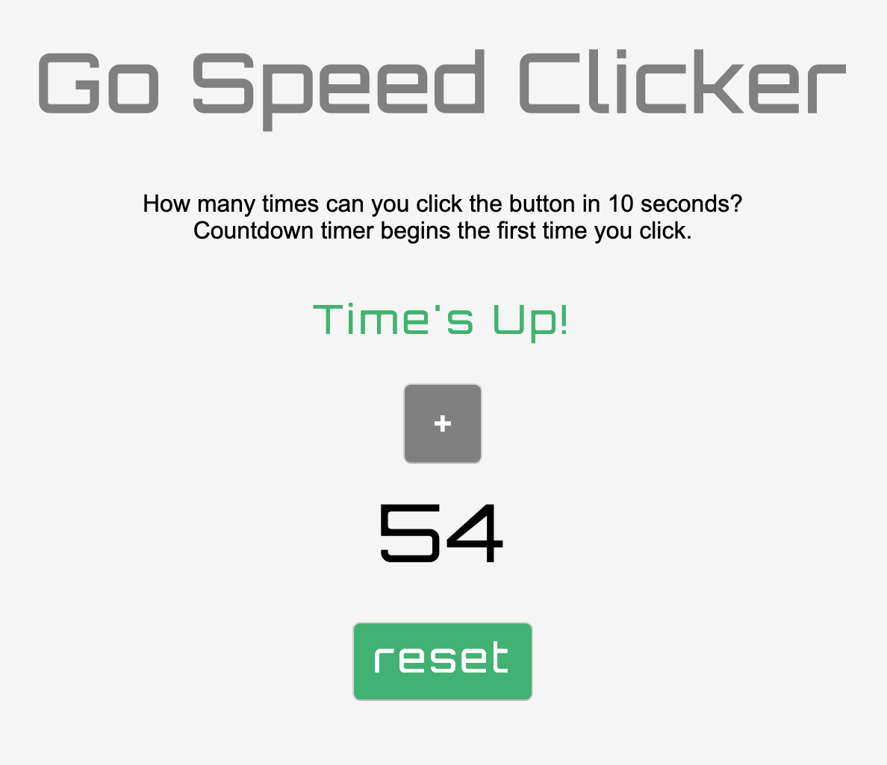

# GO! Speed Clicker in JavaScript
### > For V School // Full Stack JavaScript // January 2019 Cohort

#### Demo:
- <a href="https://htmlpreview.github.io/?https://github.com/yummywakame/V-School-Assignments/blob/master/exercises/week-04/04-go-speed-clicker/index.html" target="_blank">Speed Clicker Game</a>

#### Completed according to assignment instructions: 
- https://coursework.vschool.io/go-speed-clicker/

#### Added extra features:
- uses LocalStorage to save results, which display when returning to page
- the game only starts once the button is pressed
- at the end of the game the user is given the option to reset and restart the game

