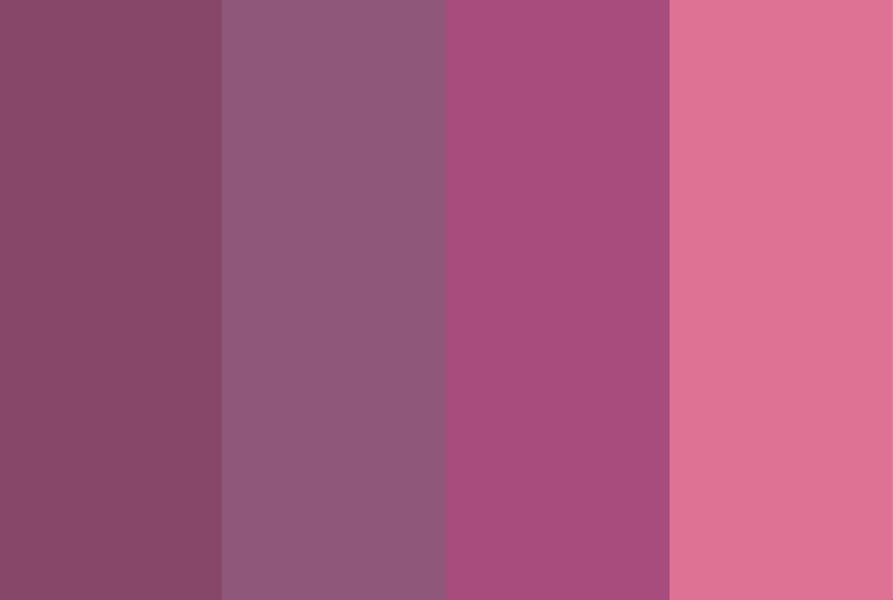
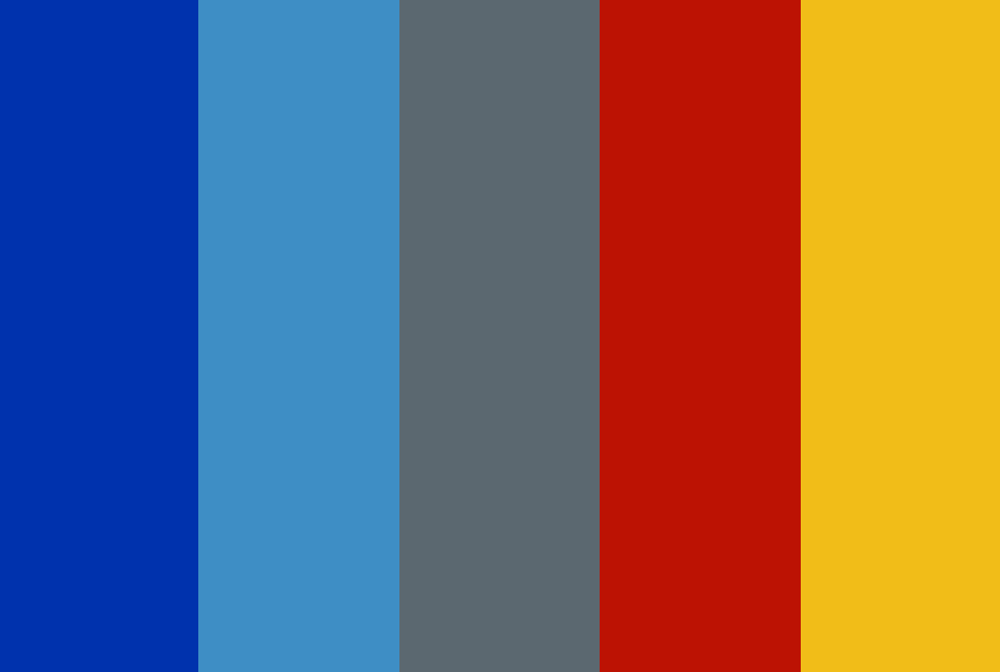

# Random Color Component from API
### > For V School // Full Stack JavaScript // January 2019 Cohort

#### React Demo:
- <a href="https://yw-random-color-scheme.surge.sh" target="_blank">Random Color Scheme Generator</a>

#### Completed according to assignment instructions: 
- https://coursework.vschool.io/random-color-component/
- Create a component that uses axios to GET a random color from the random color API and sets that component's background color to that random color.
- Upgraded to display a random colorscheme with varying number of columns that are equal width.

#### Screenshots:

