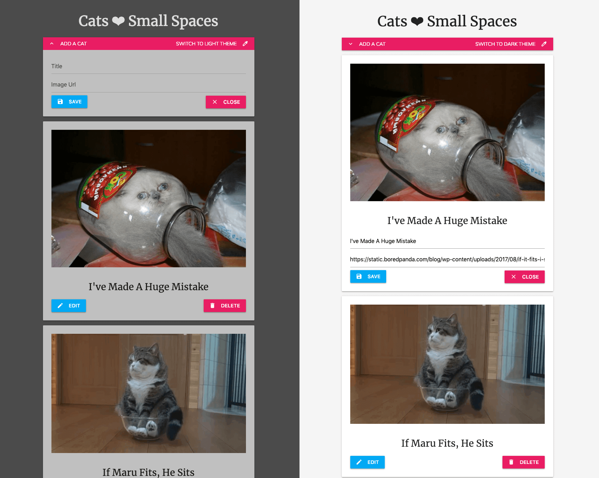

# Fully CRUD React App with Theme Switcher & localStorage
### > For V School // Full Stack JavaScript // January 2019 Cohort

#### Demo:
- <a href="https://yw-cats.surge.sh" target="_blank">Cats &#10084; Small Spaces</a>

#### Completed according to assignment instructions: 
Combined two assignments into one:
- <a href="https://coursework.vschool.io/context-themes/">Changing Themes With Context</a>
- <a href="http://coursework.vschool.io/ugly-things/">Ugly Things</a>

#### Screenshot:

