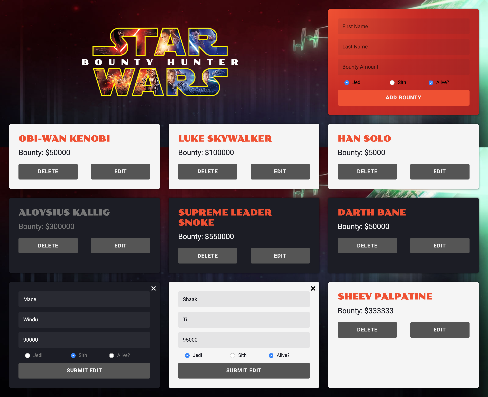

# The Original Bounty Hunter
### > For V School // Full Stack JavaScript // January 2019 Cohort

## Fully CRUD app using Mongoose and MongoDB backend with a responsive client-side React interface

#### Completed according to assignment instructions: 
- https://coursework.vschool.io/the-original-bounty-hunter/
- http://coursework.vschool.io/bounty-hunting-with-mongoose/

#### Screenshot:

