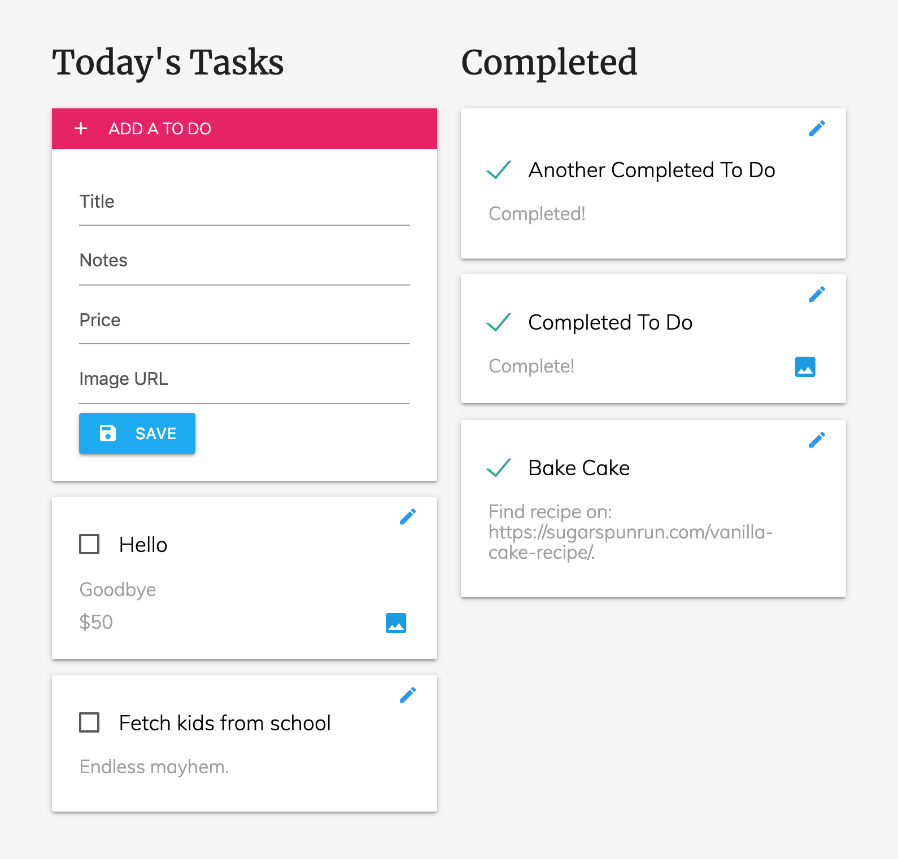

# Axios To Do App
### > For V School // Full Stack JavaScript // January 2019 Cohort

#### Completed according to assignment instructions: 
- https://coursework.vschool.io/axios-todo-practice/

#### Deployed at:
- yw-todo-list.surge.sh

#### Notes:
- Created in Vanilla JavaScript with Materialize using V School's To Do list API.
- Fully responsive for desktop or phone.
- We were required to add price.

